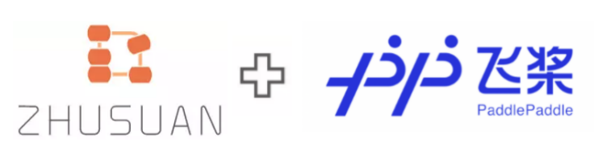

[](https://zhusuan-paddlepaddle.readthedocs.io/en/main/?badge=main)

# Zhusuan-PaddlePaddle

<div align="center">
  <a href="http://zhusuan.readthedocs.io"> </a>
</div>

---

ZhuSuan-PaddlePaddle is a python probabilistic programming library for
**Bayesian deep learning**, which conjoins the complimentary advantages of
Bayesian methods and deep learning. ZhuSuan is built upon
[PaddlePaddle](https://www.paddlepaddle.org.cn/). Unlike existing deep learning
libraries, which are mainly designed for deterministic neural networks and
supervised tasks, ZhuSuan-PaddlePaddle provides deep learning style primitives and
algorithms for building probabilistic models and applying Bayesian inference.
The supported inference algorithms include:

* Variational inference with programmable variational posteriors, various
objectives and advanced gradient estimators (SGVB, SWI, etc.).

* Importance sampling for learning and evaluating models, with programmable
proposals.

* MCMC samplers: Hamiltonian Monte Carlo (HMC) with parallel chains, and
Stochastic Gradient MCMC (sgmcmc).


## Installation

ZhuSuan-PaddlePaddle is still under development. Before the first stable release (1.0),
please clone the repository and run
```
pip install .
```
in the main directory. This will install ZhuSuan and its dependencies
automatically.  Notice that currently ZhuSuan-PaddlePaddle is built on PaddlePaddle 
version 2.0rc.

If you are developing ZhuSuan, you may want to install in an
"editable" or "develop" mode. Please refer to the Contributing section below.

## Documentation

* [Tutorials and API docs](https://zhusuan-paddlepaddle.readthedocs.io/en/main/?badge=main)

## Examples

We provide examples on traditional hierarchical Bayesian models and recent
deep generative models.

* Gaussian: 
  [HMC](examples/toy_models/gaussian.py)
* Bayesian Neural Networks:
  [SGVB](examples/bayesian_neural_nets/bnn_vi.py),
  [SGMCMC](examples/bayesian_neural_nets/bnn_sgmcmc.py)
* Variational Autoencoder (VAE):
  [SGVB](examples/variational_autoencoders/vae_mnist.py),
  [IWAE](examples/variational_autoencoders/vae_iw.py)

## Citing ZhuSuan-PaddlePaddle

If you find ZhuSuan-PaddlePaddle useful, please cite it in your publications.

```
@ARTICLE{zhusuan2017,
  title={Zhu{S}uan: A Library for {B}ayesian Deep Learning},
  author={Shi, Jiaxin and Chen, Jianfei. and Zhu, Jun and Sun, Shengyang
          and Luo, Yucen and Gu, Yihong and Zhou, Yuhao},
  journal={arXiv preprint arXiv:1709.05870},
  year=2017,
}
```

## Contributing

We always welcome contributions to help make ZhuSuan-PaddlePaddle better. If you would like 
to contribute, please check out the guidelines [here](CONTRIBUTING.md).
